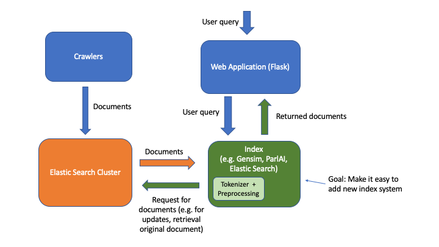

# COVID-QA

## Introduction
About 1000 papers on COVID-19 are published weekly by researchers around the world. Such rapid release of papers presents a challenge for researcheres in identifying relevant papers for their research. This is where people from computer science community can help as retrieval of information from large amounts of unstructured data has been well-studied.

Currently our system provides a full-text search of scientfic articles using TF-IDF, LSI, and LDA models built using gensim. The sources of our data are mainly from Kaggle's [COVID-19 Open Research Dataset Challenge](https://www.kaggle.com/allen-institute-for-ai/CORD-19-research-challenge) as well as collection of COVID-19 related documents from various sources such as PubMed, ClinicalTrials.gov. 

## Installation
### Clone repository
`git clone <repo_rul>`

### Install required Python packages
**Python is assumed to be Python 3** 
Run the following command to install required Python packages:
`python -m pip install -r requirements.txt`

We recommend using `virtualenv` when installing them.

### Install Elasticsearch
In the directory you want to install Elasticsearch, run:

- Linux:`wget https://artifacts.elastic.co/downloads/elasticsearch/elasticsearch-7.6.2-linux-x86_64.tar.gz`

- MacOS:`wget https://artifacts.elastic.co/downloads/elasticsearch/elasticsearch-7.6.2-darwin-x86_64.tar.gz`

Then, untar:

- Linux: `tar -xzf elasticsearch-7.6.2-linux-x86_64.tar.gz`

- MacOS: `tar -xzf elasticsearch-7.6.2-darwin-x86_64.tar.gz`

Next, modify `setup.sh` file so that `ELASTICSEARCH_ROOT` is the path to the untared `elasticsearch-7.6.2...` folder. 

Then, run `./setup.sh` to finish installing Elasticsearch. `setup.sh` will configure an Elasticsearch cluster and run Elasticsearch as a daemon in the background.

To shutdown Elasticsearch, run
`px -ef | grep Elasticsearch` to find the PID of the process and then run `kill -SIGTERM <PID>`. 

Another way to run Elasticsearch is to open a terminal multiplexer such as GNU `Screen` or `tmux` and run `$ELASTICSEARCH_ROOT/bin/elasticsearch` file directly. 

In this case, you just need to `Ctrl+C` to shutdown the Elasticsearch. However, running `setup.sh` is still necessary to set up the cluster, so you'll have to run it `setup.sh` first, shutdown Elasticsearch, and then start Elasticsearch again.

## Use
### Downloading Data
You will need a Kaggle account to download data from Kaggle COVID-19 Challenge. Once you made an account (or have an account), you'll need to authenticate using an API token. 

Go to user profile, click "My Account", and scroll down to the section of the page labelled "API". Click "Create New API Token" and download the token to your machine. 

Move the downloaded file to `~/.kaggle/kaggle.json`

Once you set up your API token, you can `cd backend` and run `python crawler.py --target kaggle`. 

This will download the data and parse the JSON files. You can choose the continue letting the process run to check once a day whether there has been any update to Kaggle dataset or simply end it.

### Launching Flask web server
After finishing installation and downloading the dataset, you can start the Flask web server by running:

`python application.py`

To have it running in the background even when logged out from a remote machine, you can either:
1. Run `python application.py &`
2. Use GNU `Screen` or `tmux` and run `python application.py`

The first time you launch the application, the server will need to build the index, so it would take some time before the server starts. If you want to avoid this step, we have prebuilt indices availble to download. 

The default port that the server listens to is 8000.

### Downloading prebuilt indicies
TBD

## Project Structure
This project builds on top of numerous article recommender system projects carried out by students at QData lab. Ppast projects' technology stacks differed not only in the frontend part but also in the backend, it always took some degree of reengineering to adapt old backend code to an new frontend stack. Also, data was collected and preprocessed once and there lacked a clear pipeline that allowed continuous addition of new data. However, new information is always available, as is the case with COVID-19. This project intends to extend past projects to have more production-level structure as well as to add new recommendation methods, such as ones based off pretrained BERT models. 

Below is a diagram of our system. We use ElasticSearch as database in our case to provide some persistent storage of documents. While NoSQL database such as MongoDB would be more suitable for this case, ElasticSearch also allows to perform quick searches on top of it. The main benefit of such clearly defined modules and API is that it is easy to develop new recommendation methods as an Index and add it to our system. 

## Task/Problems
- Add recommendation system built on-top of SciBERT
- Add crawler for PubMed, ClinicalTrials.gov
- Improve usability on mobile devices

